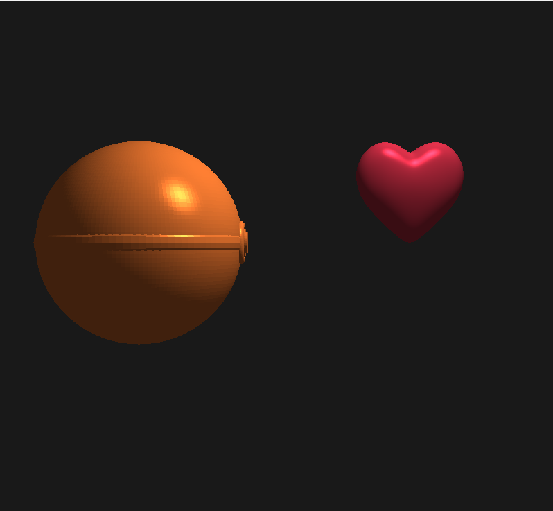
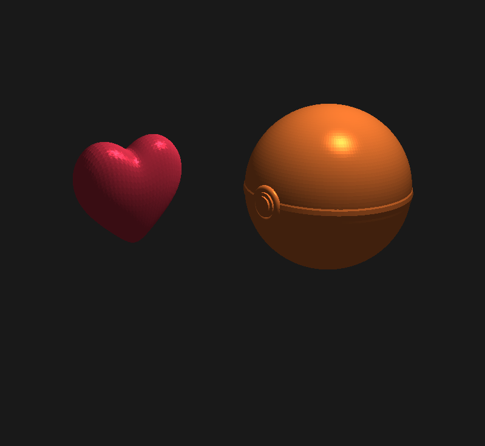

<<<<<<< Updated upstream
# Đồ án Đồ họa Máy tính - Phong & Gouraud Lighting

Dự án này thực hiện mô phỏng chiếu sáng Phong và Gouraud trên các mô hình 3D (Pokeball, Heart, Teapot) sử dụng OpenGL.

## Cấu trúc thư mục SOURCE

Thư mục **SOURCE** là thư mục gốc của đồ án, chứa tất cả các thành phần cần thiết:

- **DATA/**: Chứa các tài nguyên Shader (.shader) và mô hình 3D (.obj).
- **BaoCao/**: Chứa các file báo cáo đồ án (.docx, .pdf, .tex).
- **DHMT.slnx**: File Solution chính để mở dự án bằng Visual Studio.
- **DHMT.vcxproj**: File cấu hình dự án C++.
- **Main.cpp**: Mã nguồn chính của chương trình.
- **shaderloader.h, objloaderIndex.h...**: Các file header hỗ trợ tải shader và mô hình.
- **glew32.dll, glfw3.dll**: Các thư viện liên kết động cần thiết để chạy ứng dụng.
- **packages/**: Chứa các thư viện phụ thuộc (GLM, NuGet packages).

## Hướng dẫn chạy chương trình

1. **Mở dự án**: Mở file `DHMT.slnx` bằng Visual Studio (Khuyên dùng bản 2022).
2. **Cấu hình**: Đảm bảo chế độ build là `Debug` hoặc `Release` với nền tảng `x64` hoặc `x86`.
3. **Chạy**: Nhấn `F5` hoặc nút `Start` trong Visual Studio để biên dịch và chạy.

## Điều khiển trong chương trình

- **Phím 1, 2, 3**: Chuyển đổi giữa các mô hình (Pokeball, Heart, Teapot).
- **Phím E**: Bật/Tắt chế độ Gouraud Shading (Mặc định là Phong Shading).
- **Phím W, A, S, D**: Di chuyển Camera.
- **Phím mũi tên**: Xoay Camera.
- **Phím I, K, J, L, U, O**: Di chuyển Mô hình.
- **Phím B, N, M**: Xoay Mô hình.
- **Phím Z, X**: Phóng to/Thu nhỏ Mô hình.
- **Chuột trái**: Giữ và di chuyển dọc để Zoom Camera.
- **ESC**: Thoát chương trình.

---
**Nhóm thực hiện:**
- sv102240088 - Khoa
- sv102240118 - Trung
- sv102240113 - Tiền
=======
<div align="center">

# 🌟 Mô Phỏng Chiếu Sáng 3D
### Phong Shading & Neural Rendering

[](https://www.opengl.org/)
[](https://isocpp.org/)
[](https://www.python.org/)
[](https://visualstudio.microsoft.com/)

*Đồ án môn học: Đồ họa máy tính - Đại học Bách khoa, Đại học Đà Nẵng (DUT)*

</div>

## 👥 Nhóm Thực Hiện

| STT | Họ và Tên | Mã Sinh Viên |
| :---: | :--- | :---: |
| 1 | **Đinh Nguyễn Anh Khoa** | 102240088 |
| 2 | **Võ Thị Kim Tiền** | 102240113 |
| 3 | **Nguyễn Trần Thắng Trung** | 102240118 |

---

## 🎯 Giới Thiệu & Các Tính Năng Chính

Dự án tập trung vào việc mô phỏng ánh sáng chiếu lên vật thể 3D, ứng dụng cả các kỹ thuật truyền thống trên nền tảng OpenGL và kỹ thuật kết xuất đồ họa nâng cao bằng trí tuệ nhân tạo.

* 💡 **Kỹ thuật Truyền thống (C++/OpenGL):**
  * Cài đặt mô hình chiếu sáng **Phong Shading**.
  * Cài đặt mô hình chiếu sáng **Gouraud Shading**.
  * Đã tối ưu hóa tính toán pháp tuyến mặt (**Smooth Normals**) để bề mặt vật thể hiển thị mượt mà và chân thực hơn.
* 🧠 **Kỹ thuật Nâng cao (Python):**
  * Tích hợp **Neural Rendering** sử dụng trí tuệ nhân tạo để tính toán và xấp xỉ ánh sáng thay vì dùng công thức toán lý thuần túy.

### ⚖️ Bảng So Sánh Hai Kỹ Thuật

| Tiêu chí | C++ / OpenGL (Truyền thống) | Python (Neural Rendering) |
| :--- | :--- | :--- |
| **Bản chất tính toán** | Dựa trên công thức quang học (Toán học điểm/mặt) | Dựa trên học máy (Mạng nơ-ron) |
| **Kỹ thuật tiêu biểu** | Phong, Gouraud, Blinn-Phong | NeRF, Inverse Rendering |
| **Độ chân thực** | Tốt, nhưng phụ thuộc vào số lượng đa giác (Polygons) | Rất cao, có thể mô phỏng ánh sáng thực tế cực kỳ phức tạp |
| **Hiệu năng** | Tốc độ rất cao (Real-time), nhẹ, tính toán bằng GPU | Đòi hỏi tài nguyên phần cứng lớn, thời gian train/render lâu hơn |

---

## 🎮 Hệ Thống Điều Khiển

Dự án hỗ trợ tương tác trực tiếp qua bàn phím để thao tác với Camera và mô hình 3D trong không gian thực tế ảo:

| Nhóm | Phím tắt | Mô tả thao tác |
| :--- | :---: | :--- |
| 🎥 **Camera** | <kbd>W</kbd> / <kbd>A</kbd> / <kbd>S</kbd> / <kbd>D</kbd> | Di chuyển Camera (Tiến / Trái / Lùi / Phải) |
| 🏎️ **Dịch chuyển** | <kbd>I</kbd> / <kbd>J</kbd> / <kbd>K</kbd> / <kbd>L</kbd> | Dịch chuyển vật thể 3D (Lên / Trái / Xuống / Phải) |
| 🔄 **Xoay** | <kbd>B</kbd> / <kbd>N</kbd> / <kbd>M</kbd> | Xoay vật thể quanh các trục không gian tương ứng (X / Y / Z) |
| 🔍 **Thu phóng** | <kbd>Z</kbd> / <kbd>X</kbd> | Tỉ lệ kích thước mô hình (Phóng to / Thu nhỏ) |
| ✨ **Đổi Shading**| <kbd>E</kbd> | Chuyển đổi qua lại giữa kỹ thuật **Phong Shading** và **Gouraud Shading** |

---

## 📂 Cấu Trúc Thư Mục

```text
📦 THƯ MỤC GỐC
 ┣ 📂 DATA          # Chứa các tài nguyên 3D (pokeball.obj, heart.obj...) và file Shader (.shader)
 ┣ 📂 SOURCE        # Chứa mã nguồn C++ (OpenGL) và các script Python (Neural Rendering)
 ┣ 📜 *.sln         # File Project Solution của Visual Studio
 ┗ 📜 *.dll         # Các thư viện liên kết động đi kèm (GLEW, GLFW...)
```

---

## 🚀 Hướng Dẫn Chạy Dự Án

1. Khởi động Visual Studio (khuyên dùng bản 2019 hoặc 2022).
2. Tìm đến thư mục đã giải nén, nhấp đúp vào file `.sln` để mở dự án.
3. Nhấn phím **`F5`** (hoặc chọn nút *Local Windows Debugger*) để tiến hành biên dịch và chạy dự án.

> 📌 ***Lưu ý:** Các cấu hình thư viện liên kết và đường dẫn tương đối để gọi file từ thư mục `DATA` đã được thiết lập sẵn trong Project. Bạn có thể chạy ngay mà không cần tinh chỉnh gì thêm.*

---

## 🖼️ Hình Ảnh Demo

### Phong Shading


### Gouraud Shading


<br>

<div align="center">
  <i>Được thực hiện bởi Nhóm sinh viên Đại học Bách khoa - ĐH Đà Nẵng</i>
</div>
>>>>>>> Stashed changes
